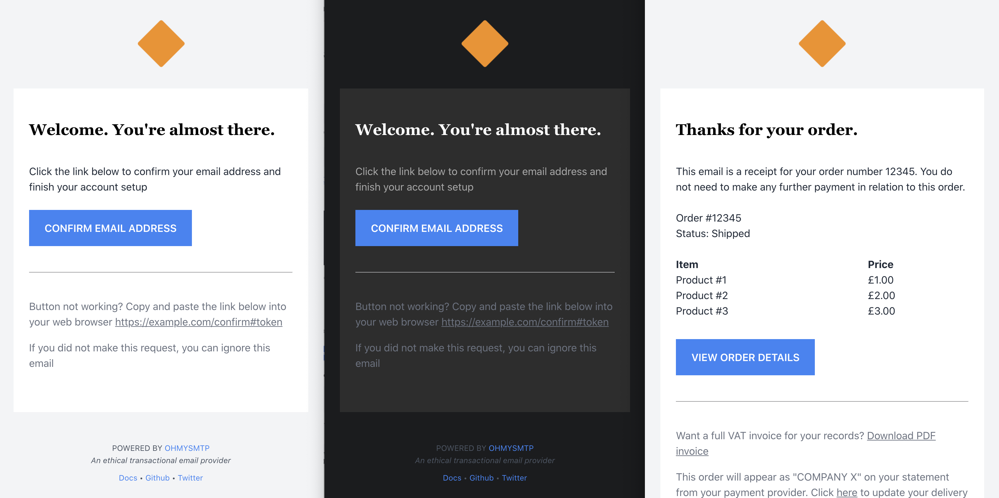

<div align="center">
  <p><a href="https://mailpace.com" target="_blank"></a></p>
  <p>A set of gorgeous Transactional HTML Email Templates built on TailwindCSS</p>
  <div>

  [![License][license-shield]][license]

  </div>
</div>

## About

This is a collection of gorgeous HTML transactional email templates, built using [Maizzle](https://maizzle.com/) and [Tailwind CSS](https://tailwindcss.com/).

They are completely free and you can use them anywhere you like, although of course we recommend using our very own transactional email provider, [mailpace](https://mailpace.com)

And yes, they support Dark Mode out of the box :)



## Show me the templates!

- **Welcome** Send a welcome email to users with a call to action [Live Preview](https://htmlpreview.github.io/?https://github.com/mailpace/templates/blob/main/dist/welcome.html)
- **Email Confirmation** Confirm a new email address [Live Preview](https://htmlpreview.github.io/?https://github.com/mailpace/templates/blob/main/dist/confirmation.html)
- **Password Reset** Reset a user's password [Live Preview](https://htmlpreview.github.io/?https://github.com/mailpace/templates/blob/main/dist/password_reset.html)
- **Receipt** Example product receipt email [Live Preview](https://htmlpreview.github.io/?https://github.com/mailpace/templates/blob/main/dist/receipt.html)
- **Security Alert** Example security alert email [Live Preview](https://htmlpreview.github.io/?https://github.com/mailpace/templates/blob/main/dist/security_alert.html)
- **Account Deleted** Notify a user on account deletion [Live Preview](https://htmlpreview.github.io/?https://github.com/mailpace/templates/blob/main/dist/account_deleted.html)

## Using the Templates

Production-ready templates are located in [/dist](./dist). To use them copy them into your application as email templates and modify any variables you want to include as per your application / sending software.

You can use [Maizzle's render method](https://maizzle.com/docs/nodejs/) to integrate with web application frameworks like Rails, Laravel and more.

## Modifying the Templates

While you can modify templates in the `dist/` folder directly, it's not recommended as you lose a lot of the pre-processing benefits. Instead follow these instructions:

1. Clone this repository

2. Install dependencies

   ```sh
   npm i -g @maizzle/cli
   cd templates
   npm install
   ```

3. Start Development

   ```sh
   npm run dev
   ```

4. Modify the templates

   You can see detailed instructions in the [Maizzle Docs](https://maizzle.com)

5. Build for Production

   ```sh
   npm run build
   ```
   Your modified templates will be available in `./dist/`

## More Documentation

Maizzle documentation is available at https://maizzle.com

## Issues, Fixes & PRs

If you find any issues please open a PR here, or contact support@mailpace.com. If you find the templates useful, please contribute back with more templates.

## Want to send transactional emails through an Independent 💪, privacy-focused 🕵️ and eco-friendly 🌱 provider?

Sign up for an account at [MailPace](https://mailpace.com)

## License

This code is open-source software licensed under the [MIT license](https://opensource.org/licenses/MIT).

[npm]: https://www.npmjs.com/package/mailpace/templates
[npm-stats]: https://npm-stat.com/charts.html?package=%40mailpace%2Ftemplates&from=2019-03-27
[npm-version-shield]: https://img.shields.io/npm/v/mailpace/templates.svg?style=flat-square
[npm-stats-shield]: https://img.shields.io/npm/dt/mailpace/templates.svg?style=flat-square&color=6875f5
[github-ci]: https://github.com/mailpace/templates/actions
[github-ci-shield]: https://img.shields.io/github/workflow/status/mailpace/cli/Node.js%20CI?style=flat-square
[license]: ./LICENSE
[license-shield]: https://img.shields.io/npm/l/mailpace/templates.svg?style=flat-square&color=0e9f6e
